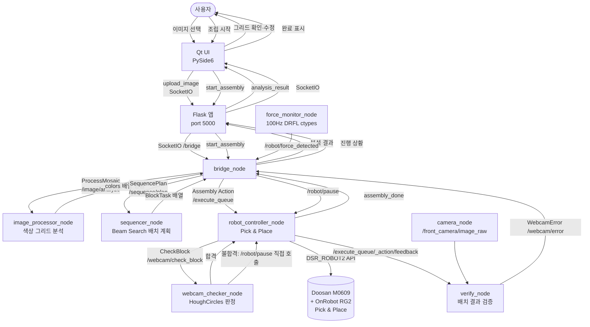
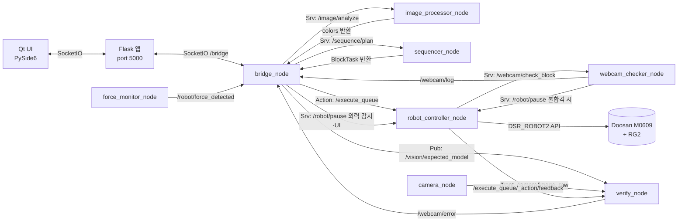

# 레고 블록 자동 조립 시스템


레고 블록 사진을 촬영하면 색상을 자동 분석하고, 두산 M0609 로봇이 키팅 트레이에서 블록을 집어 동일한 패턴으로 조립하는 시스템입니다.  
**Qt UI → Flask SocketIO → ROS2 노드 → 두산 로봇** 구조로 동작합니다.

---

## 1. 🎨 시스템 설계 및 플로우 차트

### 1-1. 시스템 설계도 (System Architecture)

| 레이어 | 구성 요소 | 역할 |
|:---|:---|:---|
| **UI** | Qt 앱 (`qt_app/main.py`) | PySide6 데스크탑 UI — 이미지 업로드, 그리드 편집, 진행 모니터링 |
| **미들웨어** | Flask 앱 (`flask_app/app.py`) | SocketIO 허브 — UI ↔ ROS2 브리지 중계 (port 5000) |
| **ROS2** | `bridge_node` | Flask ↔ ROS2 연결. 서비스·액션 클라이언트 통합 |
| **ROS2** | `image_processor_node` | 이미지를 색상 그리드로 변환 (`/image/analyze`) |
| **ROS2** | `sequencer_node` | Beam Search로 블록 배치 순서 계획 (`/sequence/plan`) |
| **ROS2** | `robot_controller_node` | Pick & Place 실행, Force 제어 (`/execute_queue`) |
| **ROS2** | `verify_node` | 정면 카메라로 배치 결과 검증 |
| **ROS2** | `camera_node` | USB 카메라 드라이버 (by-id 경로, `usb_camera.yaml` 설정) |
| **ROS2** | `webcam_checker_node` | Pick 전 웹캠으로 블록 존재 확인 (`/dev/video0` 존재 시 자동 추가) |
| **ROS2** | `force_monitor_node` | DRFL ctypes 직접 연결, 100Hz 외력 감지 |
| **하드웨어** | Doosan M0609 + OnRobot RG2 | 실제 로봇 동작 |

---

### 1-2. 플로우 차트 (Flow Chart)



### 1-3. 토픽 / 서비스 / 액션 맵 (Communication Map)



---

## 2. 🖥️ 운영체제 환경 (OS Environment)

| 항목 | 내용 |
|:---|:---|
| **OS** | Ubuntu 22.04 LTS |
| **ROS 2** | Humble Hawksbill |
| **Python** | 3.10.x (ROS 2 Humble 기본) |
| **IDE** | VS Code |
| **로봇 드라이버** | `m0609_rg2_bringup`, `DSR_ROBOT2`, `DR_common2`, `DR_init` |
| **DRFL 라이브러리** | `libdsr_hardware2.so` (force_monitor_node ctypes 연결) |

---

## 3. 🛠️ 사용 장비 목록 (Hardware List)

| 장비명 (Model) | 수량 | 비고 |
|:---:|:---:|:---|
| Doosan Robotics M0609 | 1 | `ROBOT_MODEL="m0609"`, IP: `192.168.1.100`, Port: `12345` |
| OnRobot RG2 그리퍼 | 1 | Digital I/O 제어 (GRIP: DO1/DI1, RELEASE: DO2/DI2) |
| USB 카메라 (Logitech C270) | 1 | `/dev/v4l/by-id/usb-046d_C270_HD_WEBCAM_...-video-index0` — 정면 색상 분석 및 조립 검증 |
| USB 웹캠 | 1 | `/dev/video0` — Pick 전 블록 존재 확인 |
| 키팅 트레이 | 2 | 색상(yellow·red·blue·green) × 유형(2×2·3×2) 각 1개 |
| ROS 2 실행 PC | 1 | 워크스테이션, 이더넷으로 로봇 컨트롤러 연결 |

---

## 4. 📦 의존성 (Dependencies)

### ROS 2 (apt)

```
rclpy
std_msgs
std_srvs
sensor_msgs
cv_bridge
launch
launch_ros
ament_index_python
```

두산 로봇 관련 패키지 (`m0609_rg2_bringup` 워크스페이스):

```
m0609_rg2_bringup
DSR_ROBOT2
DR_common2
DR_init
dsr_hardware2   # force_monitor_node용 DRFL ctypes
```

### Python (pip) — Flask 앱

```
# src/flask_app/requirements.txt
flask
flask-socketio
```

### Python (pip) — Qt 앱

```
# src/qt_app/requirements.txt
PySide6
python-socketio[client]
```

### Python (pip) — 공통

```
opencv-python
numpy
pyyaml
```

---

## 5. ▶️ 실행 순서 (Usage Guide)

> 터미널 5개를 열어 아래 순서대로 실행합니다.

### Step 0. 워크스페이스 빌드 (최초 1회)

```bash
cd ~/rokey_proj_01_demo/rokey_proj_01
source /opt/ros/humble/setup.bash
colcon build --symlink-install
source install/setup.bash
```

---

### ⚠️ 실행 전 필수 확인 — 하드코딩 경로 3곳

다른 PC에서 실행하는 경우 아래 세 곳의 경로를 환경에 맞게 수정해야 합니다.

**① `force_monitor_node` — DRFL 라이브러리 경로**

파일: `src/cobot1/cobot1/force_monitor_node.py`

```python
_LIBPATH = '/home/hwangjeongui/ws_cobot_pjt/ws_edu/install/dsr_hardware2/lib/libdsr_hardware2.so'
```

`libdsr_hardware2.so`의 실제 위치로 수정합니다.

---

**② `camera_node` — 정면 카메라 디바이스 경로**

파일: `src/cobot1/config/usb_camera.yaml`

```yaml
video_device: /dev/v4l/by-id/usb-046d_C270_HD_WEBCAM_200901010001-video-index0
```

`ls /dev/v4l/by-id/` 로 현재 연결된 카메라 ID를 확인 후 수정합니다.

---

**③ `webcam_checker_node` — 웹캠 디바이스 경로**

파일: `src/cobot1/launch/assembly.launch.py`

```python
WEBCAM_DEVICE = '/dev/video0'
```

`ls /dev/video*` 로 웹캠 디바이스 번호를 확인 후 수정합니다.

---

### Step 1. 두산 로봇 드라이버 실행 (터미널 1)

로봇 컨트롤러 전원을 켜고 이더넷 연결 후 실행합니다.

```bash
ros2 launch m0609_rg2_bringup bringup.launch.py \
    mode:=real \
    host:=192.168.1.100 \
    model:=m0609
```

> `mode:=virtual`로 바꾸면 실제 로봇 없이 시뮬레이션 가능합니다.

---

### Step 2. Flask SocketIO 서버 실행 (터미널 2)

```bash
python3 src/flask_app/app.py
```

> 브라우저에서 `http://localhost:5000` 으로도 접근 가능합니다.

---

### Step 3. ROS2 노드 실행 (터미널 3)

```bash
ros2 launch cobot1 assembly.launch.py
```

아래 노드들이 한 번에 실행됩니다:

| 노드 | 역할 |
|:---|:---|
| `bridge` | Flask ↔ ROS2 브리지 |
| `image_processor` | 이미지 색상 분석 |
| `sequencer` | 블록 배치 계획 |
| `robot_controller` | Pick & Place 실행 |
| `verify` | 조립 결과 검증 |
| `camera` | 정면 카메라 (by-id 경로, `config/usb_camera.yaml` 참조) |
| `force_monitor` | 외력 감지 100Hz |
| `webcam_checker` | `/dev/video0` 존재 시 자동 추가, 디바이스 `/dev/video0` 사용 |

---

### Step 4. Qt 데스크탑 UI 실행 (터미널 4)

```bash
python3 src/qt_app/main.py
```

---

### Step 5. 카메라 영상 확인 (터미널 5, 선택)

```bash
ros2 run rqt_image_view rqt_image_view
```

`/front_camera/image_raw` 또는 `/vision/debug_grid` 토픽을 선택하면 됩니다.

---

### 실행 요약

```
[터미널 1] ros2 launch m0609_rg2_bringup bringup.launch.py mode:=real host:=192.168.1.100 model:=m0609
[터미널 2] python3 src/flask_app/app.py
[터미널 3] ros2 launch cobot1 assembly.launch.py
[터미널 4] python3 src/qt_app/main.py
[터미널 5] ros2 run rqt_image_view rqt_image_view          # 선택
```
